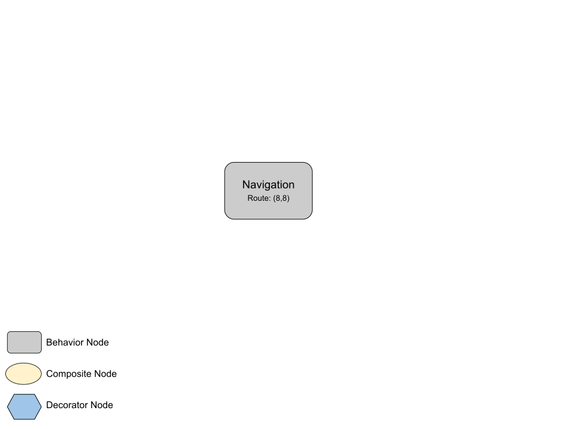
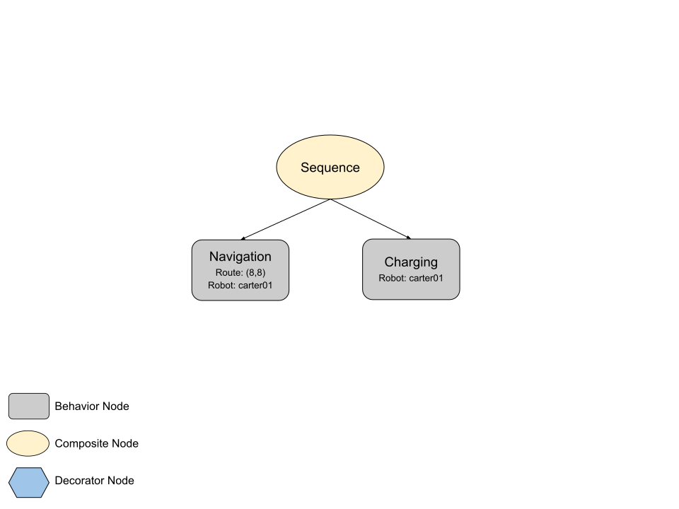
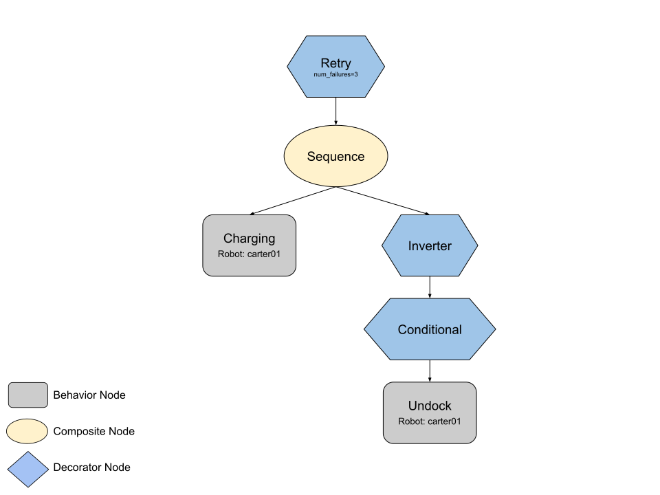

# Objectives

## What is an Objective

An **Objective** is a hierarchical structure used to define and manage missions as a behavior tree. Each leaf node of the tree, which we define as **behavior** nodes, corresponds to a mission on-robot. One of the driving principles behind the **Objective** is that it's robot-agnostic - meaning we can use it to coordinate a hetergenous fleet of robots to accomplish a singular objective. You can query the state of the objective through the `GET /objective` endpoint in the Mission Dispatch API. 

## Node Classes and Types

### ObjectiveNodeClass

The `ObjectiveNodeClass` enum defines the possible classes of nodes:
- **COMPOSITE**: Nodes that can have children and define control flow.
- **BEHAVIOR**: Leaf nodes that perform actions - usually a mission on robot.
- **DECORATOR**: Nodes that modify the behavior of a single direct child node.

### ObjectiveNodeType

The `ObjectiveNodeType` enum represents the specific types of nodes, categorized into:
- **Composite Types**:
  - `SEQUENCE`: Executes children in order until one fails.
  - `SELECTOR`: Executes children in order until one succeeds.
  - `PARALLEL`: Executes all children simultaneously.
- **Behavior Types**:
  - `NAVIGATION`, `CHARGING`, `UNDOCK`, `PICKPLACE`, `OBJ_DETECTION`, `APRILTAG_DETECTION`, `SLEEP`: Perform specific actions.
- **Decorator Types**:
  - `CONDITIONAL`: Evaluates a condition before deciding to execute its child node.
  - `RETRY`: Retries the execution of its child node on failure.
  - `REPEAT`: Retries the execution of its child node on success.
  - `INVERTER`: Inverts the result of its child node.

## Constructing the Objective Tree

#### Composite Node

```json
{
    "node_class": "COMPOSITE",
    "node_type": "SEQUENCE",  // SEQUENCE | COMPOSITE | PARALLEL
    "children": [
        {...},
        ...
    ]
}
```

Composite nodes take a list of children and control the flow of the behavior tree. The "node_type" is one of `SEQUENCE`, `SELECTOR`, or `PARALLEL`, and "children" is a list of Objective nodes. 

#### Decorator Node

```json
{
    "node_class": "DECORATOR",
    "node_type": "CONDITIONAL",  // CONDITIONAL | RETRY | REPEAT | INVERTER
    "parameters": { ... },
    "child": { ... }
}
```

Decorator nodes manage a single Objective node child. They accept "parameters" that vary based on the "node_type". For more information, visit the [Objectives decorators guide](objectives_decorators.md).
#### Behavior Node

```json
{
    "node_class": "BEHAVIOR",
    "node_type": "NAVIGATION",  // NAVIGATION | CHARGING | UNDOCK | PICKPLACE | OBJ_DETECTION | APRILTAG_DETECTION
    "parameters": { ... },
    "outputs": { ... }
}
```

Behavior nodes are leaf nodes with no children. In most cases, a Behavior node represents a single mission. They accept a list of parameters which are used to construct the mission depending on the "node_type". The "outputs" are used for storing the output, or result, of a Behavior to be used later in the objective. For more information, visit the [Objectives context guide](objectives_context_guide.md). 


## Examples

An Objective can be as simple as a singular Behavior node. This is equivalent to submitting the mission directly through the API. Below we have an example of a singular Navigation behavior node:
<table>
<tr>
<td>

```json
{
    "node_class": "BEHAVIOR",
    "node_type": "NAVIGATION",
    "parameters": {
        "route": [
            {
                "x": 8,
                "y": 8
            }
        ]
    }
}
```
<br>

</td>
</tr>
</table>

After the navigation mission, we want the same robot to return to a charging dock. We can chain a Navigation and Charging mission together using the Sequence composite node:

<table>
<tr>
<td>

```json
{
    "node_class": "COMPOSITE",
    "node_type": "SEQUENCE",
    "children": [
        {
            "node_class": "BEHAVIOR",
            "node_type": "NAVIGATION",
            "parameters": {
                "robot_name": "carter01",
                "route": [
                    {
                        "x": 8,
                        "y": 8
                    }
                ]
            }
        },
        {
            "node_class": "BEHAVIOR",
            "node_type": "CHARGING",
            "parameters": {
                "robot_name": "carter01"
            }
        }
    ]
}
```
<br>

</td>
</tr>
</table>

Let's say the robot does not always begin charging successsfully on the first Charging mission. We want the robot to first attempt a Charging mission. If it succeeds and the robot's state is verified to be CHARGING, then the Objective is marked as complete. Otherwise, if the robot's state does not transition to CHARGING after the Charging mission, we want to undock the robot, and repeat this process up to 3 times. This can be represented by the Objective tree shown below. Note that we use the Conditional Decorator node to verify the robot state at Mission run-time and the Inverter Decorator node to create the behavior that we want. For more information on decorators, visit the [Objectives decorators guide](objectives_decorators.md).

<table>
<tr>
<td>

```json
{
    "node_class": "DECORATOR",
    "node_type": "RETRY",
    "parameters": {
        "num_failures": 3
    },
    "child": {
        "node_class": "COMPOSITE",
        "node_type": "SEQUENCE",
        "children": [
            {
                "node_class": "BEHAVIOR",
                "node_type": "CHARGING",
                "parameters": {
                    "robot_name": "carter01",
                    "dock_id": "dock01"
                }
            },
            {
                "node_class": "DECORATOR",
                "node_type": "INVERTER",
                "parameters": {},
                "child": {
                    "node_class": "DECORATOR",
                    "node_type": "CONDITIONAL",
                    "parameters": {
                        "condition": {
                            "type": "COMPARISON",
                            "operator": "NEQ",
                            "operands": ["robot_state(carter01)", "CHARGING"]
                        }
                    },
                    "child": {
                        "node_class": "BEHAVIOR",
                        "node_type": "UNDOCK",
                        "parameters": {
                            "robot_name": "carter01"
                        }
                    }
                }
            }
        ]
    }
}
```
<br>

</td>
</tr>
</table>
